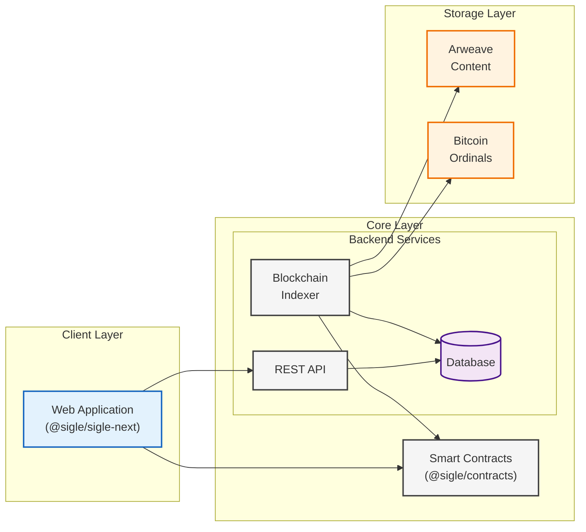

# Technical Architecture

Sigle is a monorepo that contains multiple packages. The main packages are:

- [`@sigle/contracts`](https://github.com/sigle/sigle/tree/main/apps/contracts): The protocol contracts and tests.
- [`@sigle/sdk`](https://github.com/sigle/sigle/tree/main/packages/sdk): The SDK package that contains all the schemas and logic to interact with the protocol.
- [`@sigle/server-next`](https://github.com/sigle/sigle/tree/main/apps/server-next): The backend server that serves the API and host the indexer logic.
- [`@sigle/sigle-next`](https://github.com/sigle/sigle/tree/main/apps/sigle-next): The web application one interacts with.

## Overview

