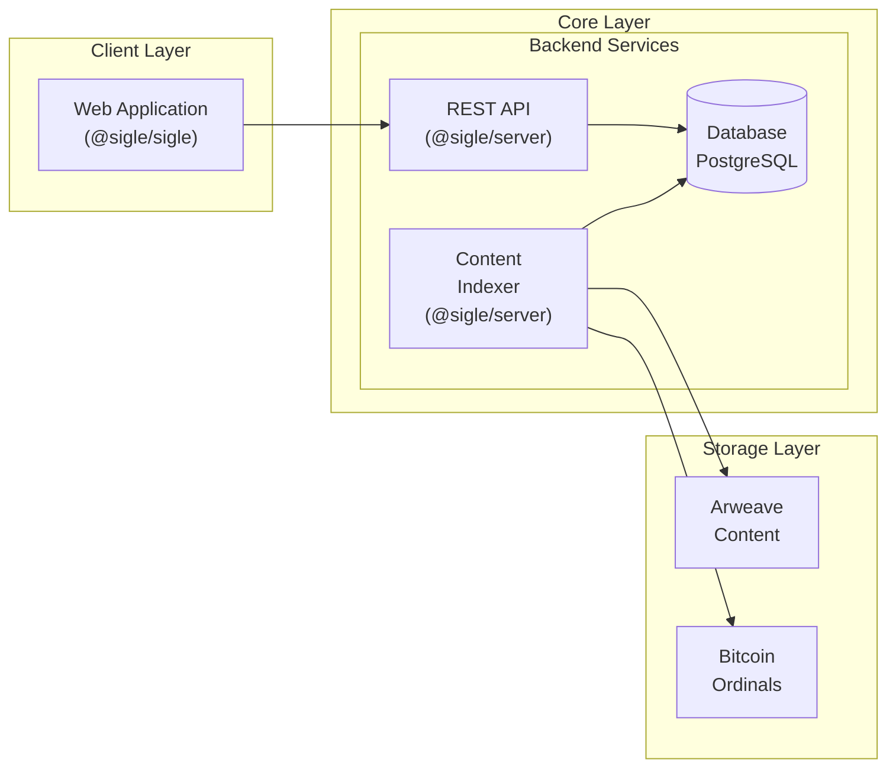

Sigle is a monorepo that contains multiple packages. The main packages are:

- [`@sigle/sdk`](https://github.com/sigle/sigle/tree/main/packages/sdk): The SDK package that contains all the schemas and logic to interact with the protocol.
- [`@sigle/server`](https://github.com/sigle/sigle/tree/main/apps/server): The backend server that serves the API and host the indexer logic.
- [`@sigle/sigle`](https://github.com/sigle/sigle/tree/main/apps/sigle): The web application one interacts with.

## Overview

## Storage

Sigle uses multiple decentralized storage systems to store the content created by users:

- Post content: Arweave by default, users can also upload content as Bitcoin Ordinals.
- Profile metadata: Arweave.
- Images: IPFS.
